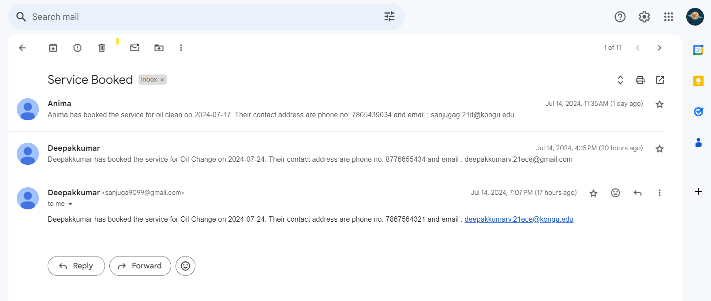
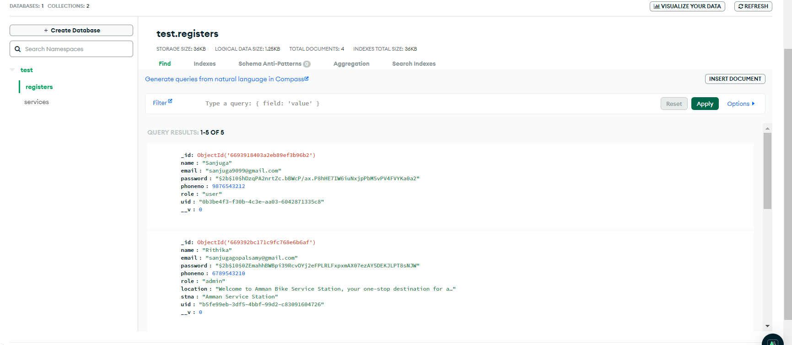
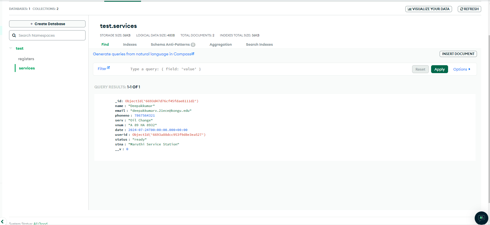

## Steps to Run this Project:

    1. Clone this repository( git clone url)
    2. In the console run the command( npm install )

## To run backend

    1. cd backend
    2. nodemon index.js

## To run frontend

    1. npm start

## To run json file

    1. cd backend
    2. npx json-server -p 8002 -w data.json

Run the frontend, backend and json file concurrently in different Terminal

backend file - backend file contains all the api based logics
FrontEnd file - It contains the structure and the css of the UI
Json file - It is for storing category based information

## Schema Details

1.  UserDetails:

        Role: "admin"
            name
            email
            password
            phoneno
            role
            location
            station name
            description
            uid

        Role: "user"
            name
            email
            password
            phoneno
            role
            uid

2.  Services:

    name
    email
    phoneno
    services
    vehicle number
    date
    userid
    status
    station name

3.Category: -> Stored as a json file

    cname
    description
    location
    adminUid
    stationName

### sample data:

Anyone can register can admin and add their services
This is one of the already existing admin login credentials
admin login:
email: ravinac.21it@kongu.edu
pass : ravina@9099

Anyone can register can user and book their required services
This is one of the already existing user login credentials
user login:
email:deepakkumarv.21ece@kongu.edu
pass : deepak@9099

Admin receives the mail while the user books the services:
Sample photo:

## Schema Images:

    Register:
    

    Service:
    
